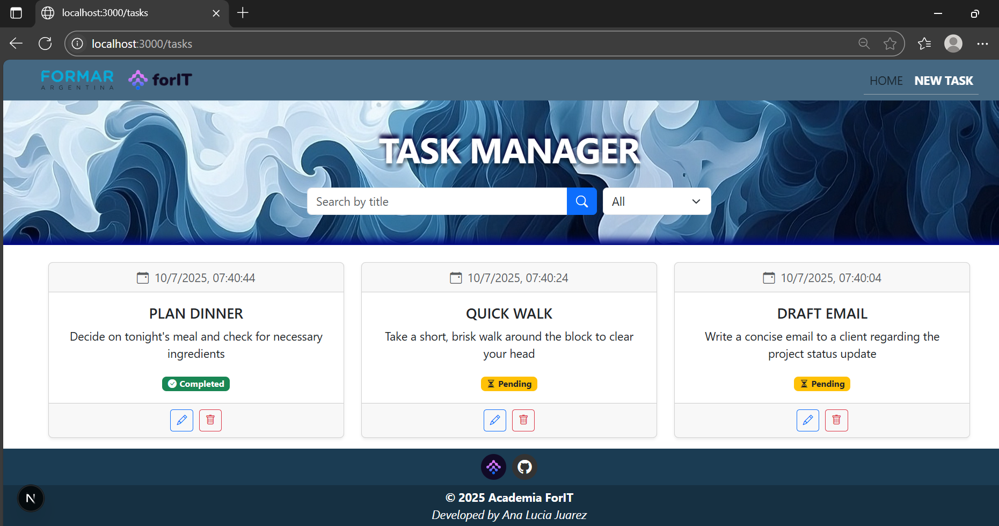
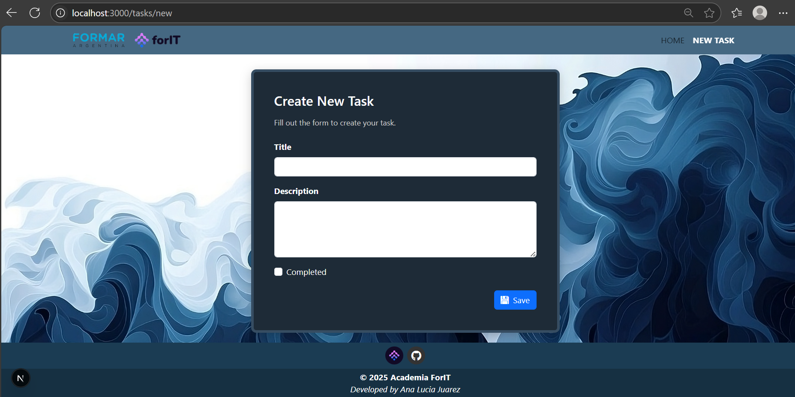
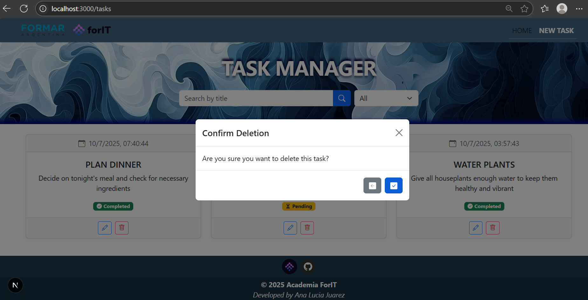
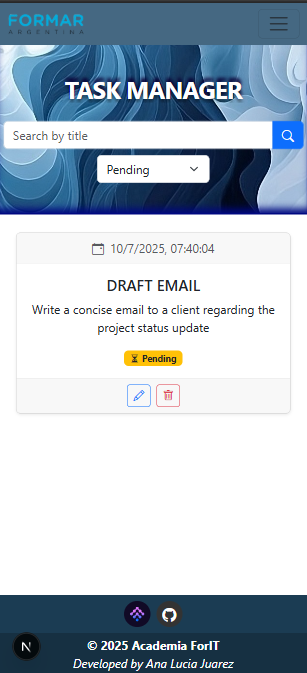
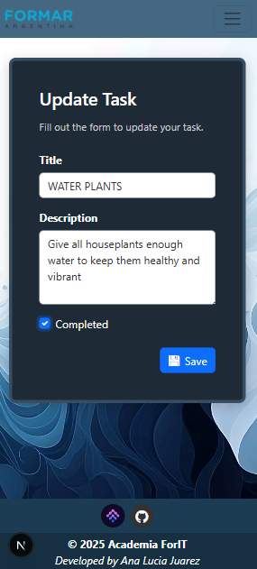

<section align="center">
    <h1 align="center">Academia ForIT  Challengue</h1>
    
   <section align="center">
        
   </section>
</section>

Application built to participate in the Academia ForIT Challenge. The app is a task management system developed with Next.js on the frontend and Express + Prisma + SQLite3 on the backend. It allows you to easily create, search, update and delete tasks.

---

## Table of Contents

1. [Technologies](#technologies)
2. [Prerequisites](#prerequisites)
3. [Project installation](#project-installation)
4. [Main features](#main-features)
5. [Screenshots](#screenshots)
6. [Author](#author)

---

## Technologies

### Backend

| Node.js | Express | Prisma ORM | SQLite3 |
|:--:|:--:|:--:|:--:|
|  |  |  |  |

### Frontend

| Next.js | React | Bootstrap 5 |
|:--:|:--:|:--:|
|  |  |  |

---

## Prerequisites

Install the following programs

- **[Node.js](https://nodejs.org/en/)**
- **[npm](https://www.npmjs.com/)**
- **[Git](https://git-scm.com/)**

---

## Project installation

### 1. Clone the repository

```bash
git clone https://github.com/manita02/AcademiaForITChallengue.git
cd AcademiaForITChallengue
```

---

### 2. Install dependencies

#### Backend

```bash
cd backend
npm install
```

#### Frontend

```bash
cd ../frontend
npm install
```

---

### 3. Set up the environment

#### Backend

Inside the `backend` folder, create the `.env` file:

```bash
cd backend
touch .env
```

Add the following:

```env
DATABASE_URL="file:./dev.db"
PORT=3001
```

---

### 4. Prepare the database

```bash
cd backend
npx prisma generate
npx prisma migrate dev --name init
```

This will create the SQLite database (`dev.db`) and apply the schema.

---

### 5. Start the servers

#### Backend

From the `backend` folder:

```bash
npm run dev
```

This will start the backend at:
`http://localhost:3001`

---

#### Frontend

In another terminal:

```bash
cd frontend
npm run dev
```

This will start the frontend at: 
`http://localhost:3000`

---

## Main features

- Create new tasks
- Update and delete existing tasks
- Search for tasks by title

---

## Screenshots

| Home | New Task | Delete Task |
|:--:|:--:|:--:|
|  |  |  |

| Mobile View| Update Task |
|:--:|:--:
|  |  |


## Author

| [<br><sub>Ana Lucia Juarez</sub>](https://github.com/manita02) | 
| :---: |